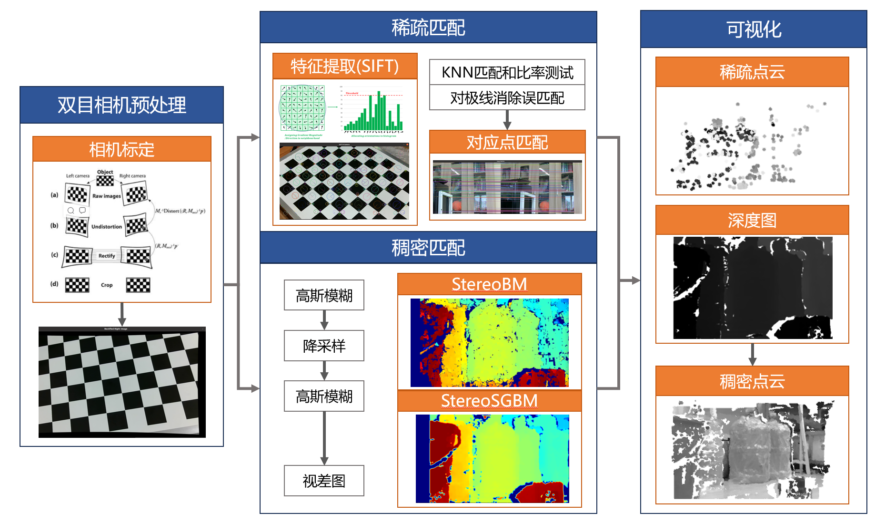
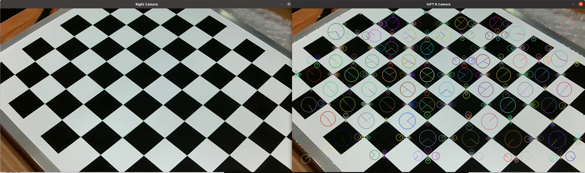
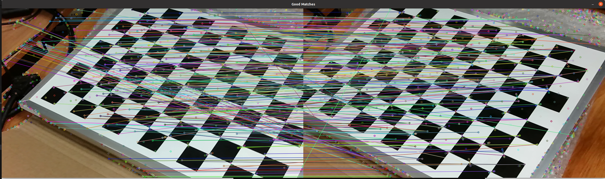
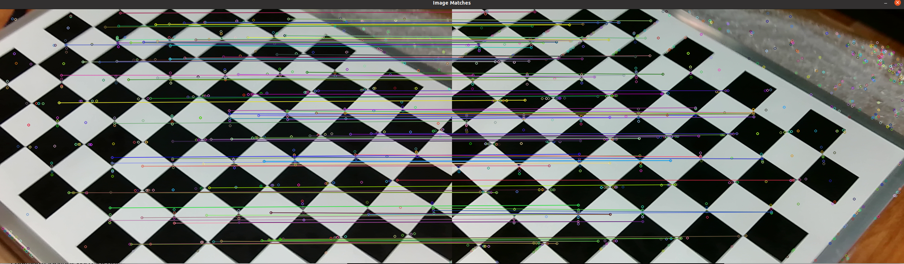
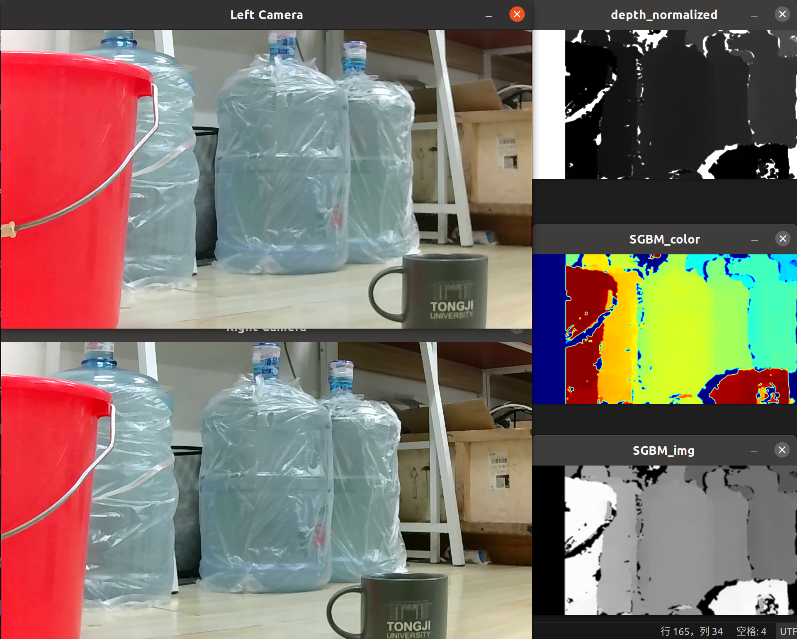
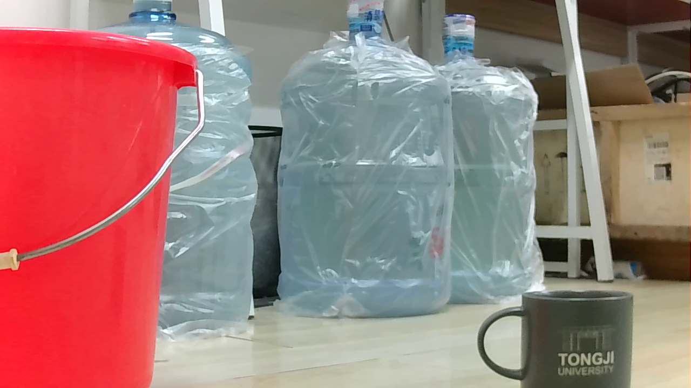
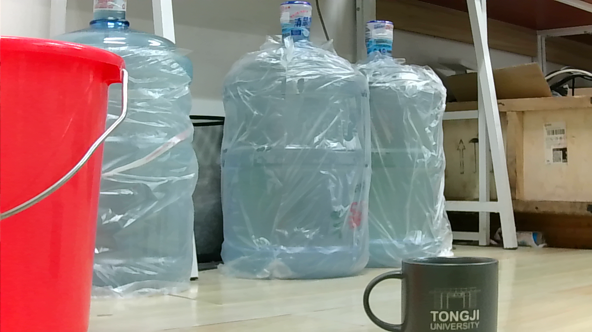
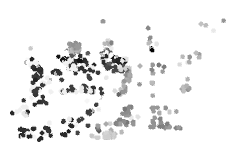
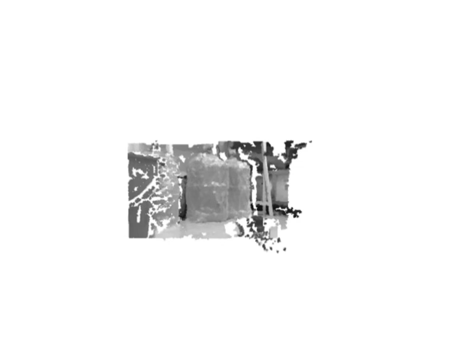

# Stereo_Camera_HBVCAM
A project of stereo camera with HBVCAM-W202011HD V33

## Overview

## Fuction
- get_frames: capture frames with camera
- calibration：singel camera calibration & stereo camera calibration
- realtime_depthmap.cpp: 1. feature point(by SIFT); 2. generate realtime disparity and depth map
- 3d_point_cloud_sparse.cpp: realtime sparse pointcloud
- 3d_point_cloud_dense.cpp: realtime dense pointcloud

## SIFT
### original frame

### matches before filtering

### matches after filtering

## Disparity and Depth map

## Pointcloud

<table>
  <tr>
    <td>
      
      
Left Frame

    </td>
    <td>
      
      
Right Frame

    </td>
  </tr>
</table>

### sparse pointcloud

### dense pointcloud

